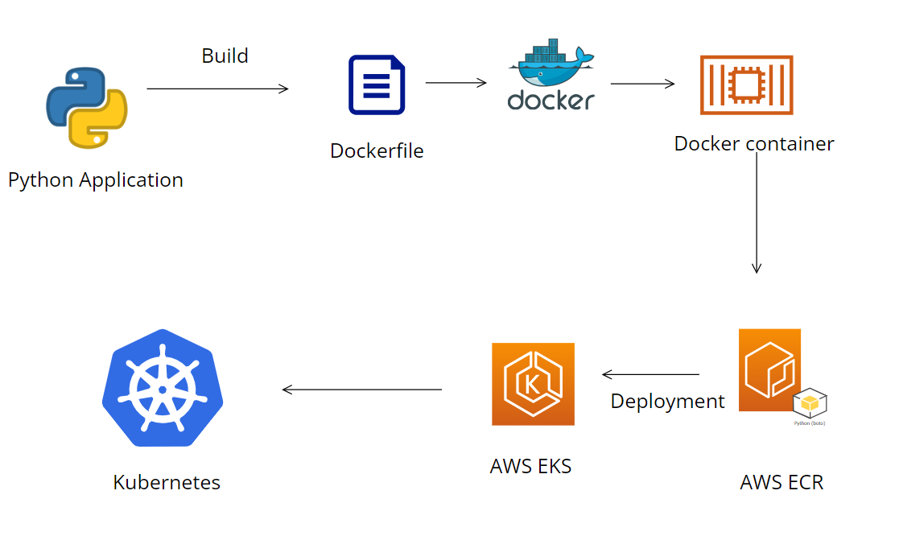
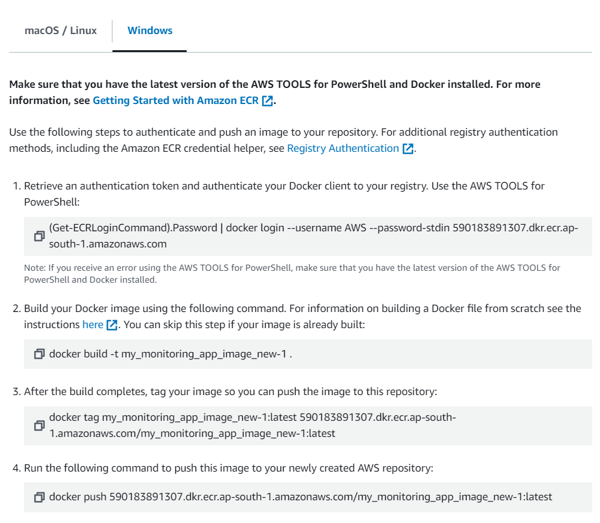
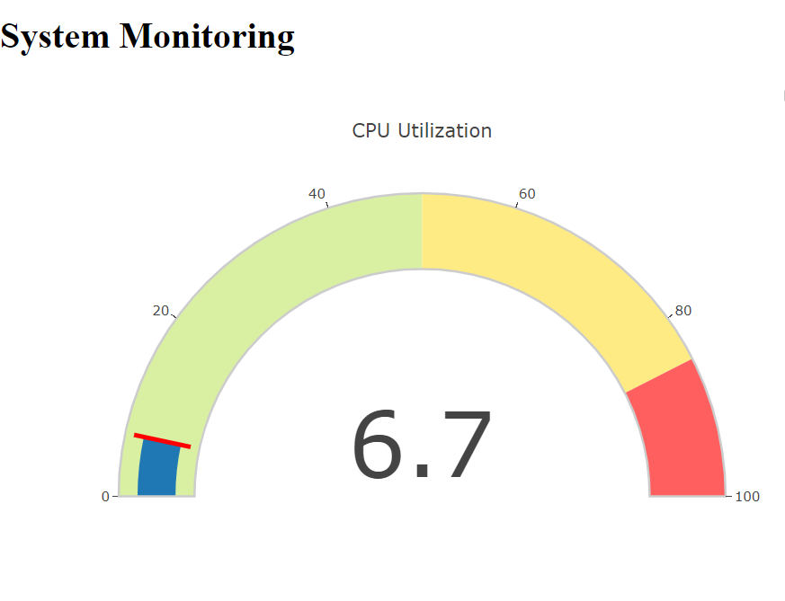
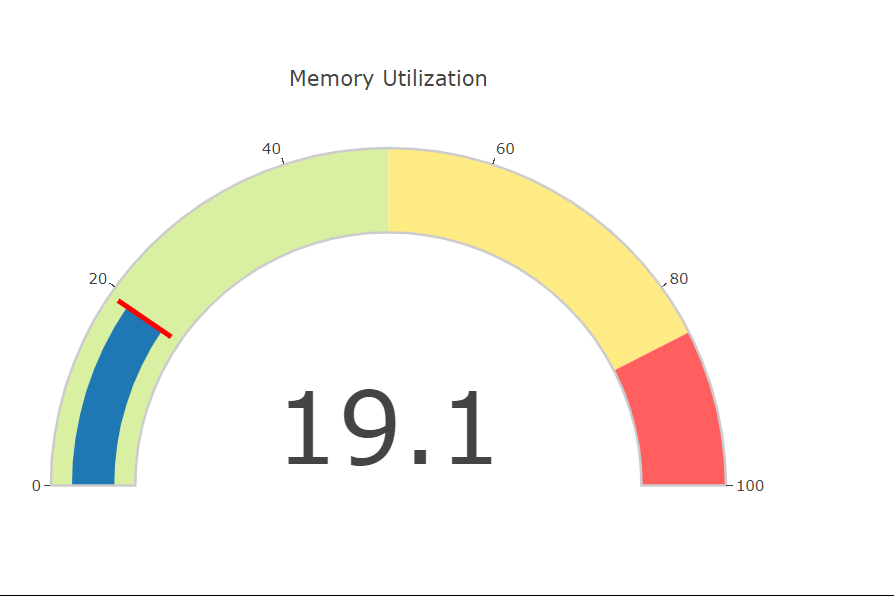

# Cloud Native Resource Monitoring Python App on K8s

## Introduction:
The Cloud Native Resource Monitoring Python App on Kubernetes is designed to provide real-time monitoring of CPU and memory utilization within a Kubernetes cluster. Leveraging Flask for web application development and psutil for system metrics, this application offers a dynamic dashboard accessible via a web browser. Users can view current CPU and memory metrics, with alerts triggered if either metric exceeds 80%, indicating potential resource strain. Deployed on Kubernetes, the application ensures scalability and resilience by leveraging Kubernetes' orchestration capabilities, facilitating seamless management of containerized workloads in a cloud-native environment.

## Prerequisites :
AWS Reqiurements: 
1. AWS Elastic Kubernetes Service.
2. AWS Elastic Container Registry.

Python3 Installed.

Docker and Kubectl installed.

## Architecture:

## let's start the Deplyment now 

### Part 1: Deploying the Flask application locally

#### Step 1: The application uses the psutil and Flask, Plotly, boto3 libraries. Install them using pip:

 ~~~
 pip3 install -r requirements.txt
 ~~~
#### Step 3: Run the application
~~~
python3 app.py
~~~

Note: This will start the Flask server on localhost:5000. Navigate to http://localhost:5000/ on your browser to access the application.

### Part 2: Dockerizing the Flask application

#### Step 1: Create a Dockerfile in the root directory of the project with the following contents:
~~~
# Use the official Python image as the base image
FROM python:3.9-slim-buster

# Set the working directory in the container
WORKDIR /app

# Copy the requirements file to the working directory
COPY requirements.txt .

RUN pip3 install --no-cache-dir -r requirements.txt

# Copy the application code to the working directory
COPY . .

# Set the environment variables for the Flask app
ENV FLASK_RUN_HOST=0.0.0.0

# Expose the port on which the Flask app will run
EXPOSE 5000

# Start the Flask app when the container is run
CMD ["flask", "run"]
~~~
#### Step 2: Build the Docker image
To build the Docker image, execute the following command:
~~~
docker build -t <image_name> .
~~~
This will start the Flask server in a Docker container on localhost:5000. Navigate to http://localhost:5000/ on your browser to access the application.

### Part 3: Pushing the Docker image to ECR
#### Step 1: Create an ECR repository
Create an ECR repository using Python:
~~~
import boto3

# Initialize a session using Amazon ECR
ecr_client = boto3.client('ecr')

# Specify the repository name
repository_name = "my_monitoring_app_image_new-1"

# Create the repository
response = ecr_client.create_repository(repositoryName=repository_name)

# Extract and print the repository URI
repository_uri = response['repository']['repositoryUri']
print(repository_uri)
~~~
#### Step 2: Push the Docker image to ECR
Open the Amazon ECR Console:

Navigate to the ECR console: Amazon ECR Console.
Select Your Repository:

Find and select the repository you created (my-flask-app).
View Push Commands:

Click on the "View push commands" button. This will display the exact commands you need to run based on your operating system and environment.

### Create deployment and service
~~~
#create deployment and service
from kubernetes import client, config

# Load Kubernetes configuration
config.load_kube_config()

# Create a Kubernetes API client
api_client = client.ApiClient()

# Define the deployment
deployment = client.V1Deployment(
    metadata=client.V1ObjectMeta(name="my-flask-app-1"),
    spec=client.V1DeploymentSpec(
        replicas=1,
        selector=client.V1LabelSelector(
            match_labels={"app": "my-flask-app-1"}
        ),
        template=client.V1PodTemplateSpec(
            metadata=client.V1ObjectMeta(
                labels={"app": "my-flask-app-1"}
            ),
            spec=client.V1PodSpec(
                containers=[
                    client.V1Container(
                        name="my-flask-container-1",
                        image="590183891307.dkr.ecr.ap-south-1.amazonaws.com/my_monitoring_app_image_new-1:latest",
                        ports=[client.V1ContainerPort(container_port=5000)]
                    )
                ]
            )
        )
    )
)

# Create the deployment
api_instance = client.AppsV1Api(api_client)
api_instance.create_namespaced_deployment(
    namespace="default",
    body=deployment
)

# Define the service
service = client.V1Service(
    metadata=client.V1ObjectMeta(name="my-flask-service-1"),
    spec=client.V1ServiceSpec(
        selector={"app": "my-flask-app-1"},
        ports=[client.V1ServicePort(port=5000)]
    )
)

# Create the service
api_instance = client.CoreV1Api(api_client)
api_instance.create_namespaced_service(
    namespace="default",
    body=service
)
~~~
Note: make sure to edit the name of the image on line 25 with your image Url.

Once you run this file by running “python3 eks.py” deployment and service will be created.

Check by running following commands:
~~~
kubectl get deployment -n default (check deployments)
kubectl get service -n default (check service)
kubectl get pods -n default (to check the pods)
~~~

Once your pod is up and running, run the port-forward to expose the service

~~~
kubectl port-forward service/<service_name> 5000:5000
~~~
To verify that the application is running correctly on the Kubernetes cluster, follow these steps:

### Open your web browser.

### Navigate to localhost on port 5000.

You should be able to see the application interface, confirming that the deployment was successful and the application is running as expected on the Kubernetes cluster.

## The following errors I encountered while completing the project, along with their fixes:
#### 1. Failed building wheel for psutil while installing psutil dependency in window operating system.
    solution: 
    Install Microsoft Visual C++ Build Tools

#### 2. he error message - ImportError: cannot import name 'Mapping' from 'collections'
    Solution:
    You need to ensure that the boto3 and botocore packages are up to date.

    pip install --upgrade boto3 botocore

#### 3. During the deployment of our application on Amazon EKS, we encountered a scheduling issue with our pods. The error message "FailedScheduling: 0/2 nodes are available: 2 Too many pods.
    solution:
    it is crucial to ensure that the node instances are appropriately sized according to the application's resource requirements. Using instances with higher specifications, such as t3.medium or larger, can provide the necessary resources to handle the application load efficiently.

       

                